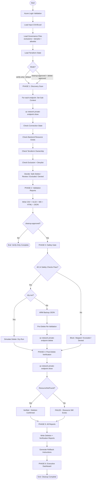

# EDAV Private Endpoint Monitor v4.0.0

> **Enterprise Azure Governance and Cleanup Platform**
> Identifies disconnected private endpoints, validates backend resources and Terraform ownership,
> generates colour-coded Excel/CSV/HTML/JSON/Markdown reports, creates ARM JSON backups,
> produces rollback instructions, safely decommissions approved endpoints with full audit trail,
> and **verifies every deletion** by confirming Azure returns ResourceNotFound.
>
> **Nothing is deleted without validation, approval, a change request, and a typed CONFIRM.**

---

## Table of Contents

1. [Architecture](#architecture)
2. [Operational Modes](#operational-modes)
3. [Safety Controls](#safety-controls)
4. [Governance Features](#governance-features)
5. [Workflow](#workflow)
6. [Installation](#installation)
7. [Input File Format](#input-file-format)
8. [Usage Examples](#usage-examples)
9. [Output Reports](#output-reports)
10. [Executive Dashboard](#executive-dashboard)
11. [Approval Process](#approval-process)
12. [Dry Run Process](#dry-run-process)
13. [Cleanup Process](#cleanup-process)
14. [Verification Process](#verification-process)
15. [Troubleshooting](#troubleshooting)
16. [Recovery Procedures](#recovery-procedures)
17. [Risk Assessment](#risk-assessment)
18. [Future Enhancements](#future-enhancements)

---

## Architecture

### Repository Structure

```
edav-private-endpoint-monitor/
├── main.py                    # Single-file enterprise platform (v4.0.0)
├── requirements.txt           # Python dependencies
├── sample_input.csv           # Input file template
├── exclusions.txt             # Endpoint exclusion list (never deleted)
├── governance/
│   ├── denylist.json          # Hard-blocked endpoint names
│   └── allowlist.json         # Pre-approved safe endpoint names
├── reports/                   # Auto-generated reports (all formats)
├── backups/                   # ARM JSON backups (pre-delete)
│   └── private_endpoints/     # One JSON file per deleted endpoint
└── logs/                      # Structured run logs
```

### Architecture Diagram



---

## Operational Modes

| Flag | Description | Deletes? | Verifies? |
|------|-------------|----------|-----------|
| *(default)* | Discovery + Validation + Reports | No | No |
| `--verify-only` | Explicit safe mode: Discovery + Validation + Reports | No | No |
| `--cleanup-approved --delete-approved --dry-run` | Full simulation, no Azure changes | No (simulated) | No (simulated) |
| `--cleanup-approved --delete-approved` | Full pipeline: Validate + Delete + Verify | Yes | Yes |

> **`--cleanup-approved` requires `--delete-approved` to be explicitly passed.**
> This is a two-key safety requirement — both flags must be present to enable deletion.

---

## Safety Controls

The platform enforces **14 ordered safety layers** before any deletion occurs:

| # | Safety Layer | Type |
|---|---|---|
| 1 | `--delete-approved` flag required | CLI |
| 2 | `--cleanup-approved` mode required | CLI |
| 3 | `ApprovedToDelete=Yes` required per row | Input file |
| 4 | Endpoint not on **denylist** | Governance |
| 5 | Endpoint not on **exclusions** list | Governance |
| 6 | `Recommended Action` must not contain blocking keyword | Scan result |
| 7 | User must type **CONFIRM** at interactive prompt | Interactive |
| 8 | **ARM JSON backup** written before every delete | Pre-delete |
| 9 | **Pre-delete re-validation**: endpoint exists AND still Disconnected | Pre-delete |
| 10 | **Subscription context verified** before each delete | Pre-delete |
| 11 | `az network private-endpoint delete` issued (ONLY delete command) | Delete |
| 12 | **Post-delete verification**: Azure must return ResourceNotFound | Post-delete |
| 13 | **Subscription-level error isolation**: one failed sub never blocks others | Resilience |
| 14 | `--dry-run` simulates entire workflow without touching Azure | Override |

> **The ONLY Azure delete command in this codebase is:**
> ```
> az network private-endpoint delete
> ```
> No backend resources (Key Vault, Storage, SQL, VNet, NIC, DNS, NSG, Subnet, Route Tables)
> are ever touched.

---

## Governance Features

### Exclusion List (`exclusions.txt`)

Plain-text file, one endpoint name per line. Lines starting with `#` are comments.
Excluded endpoints are **never deleted** regardless of approval status.

```
# EDAV Exclusions - endpoints that must never be deleted
prod-keyvault-pe
prod-sql-pe
# Temporarily excluded pending review
nceh-auth-pe
```

### Denylist (`governance/denylist.json`)

JSON array of endpoint names that are **hard-blocked** from deletion.
Takes precedence over all other settings.

```json
[
  "prod-critical-pe",
  "shared-services-pe",
  "platform-hub-pe"
]
```

### Allowlist (`governance/allowlist.json`)

JSON array of endpoint names that are pre-approved safe for governance tracking.

```json
[
  "orphaned-test-pe",
  "dev-decommissioned-pe"
]
```

### Change Ticket Reference

Pass `--change-ticket CHG0012345` to record the ITSM change request reference in every report.

### Approver Identity

Pass `--approved-by "John Smith"` to record the approver name in the audit trail and all reports.

---

## Workflow

### Phase 1: Discovery & Scan
For each endpoint in the input file, the platform:
- Sets Azure subscription context
- Calls `az network private-endpoint show`
- Extracts Connection State, Region, Backend Resource ID
- Checks if the backend resource still exists in Azure
- Checks Terraform state and `.tf` source files for ownership
- Checks exclusion list and denylist
- Assigns a Recommended Action: Safe Delete Candidate, Excluded, Denied, Review, Investigate, etc.

### Phase 2: Validation Reports
Generates all discovery and validation reports:
- `EDAV_Validation_Report_<ts>.xlsx` (colour-coded, multi-sheet)
- `EDAV_Validation_Report_<ts>.csv`
- `EDAV_Summary_<ts>.md`
- `EDAV_Report_<ts>.html` (standalone, all phases)
- `EDAV_Report_<ts>.json` (machine-readable)

### Phase 3: Cleanup Engine (`--cleanup-approved` only)
Runs all 14 safety layers, then for each approved endpoint:
1. Exports ARM JSON backup to `backups/private_endpoints/`
2. Re-validates endpoint exists and is still Disconnected
3. Verifies subscription context
4. Issues `az network private-endpoint delete`
5. Records result, duration, backup path, validation status

### Phase 4: Post-Delete Verification (NEW in v4.0.0)
For every deletion attempt:
- Calls `az network private-endpoint show` again
- If `ResourceNotFound` is returned: **Verified - Resource Not Found**
- If resource still exists: **FAILED - Resource Still Exists** (alerts operator)
- Results written to verification CSV and XLSX reports

### Phase 5: Final Reports
HTML and JSON reports updated with deletion and verification data.

### Phase 6: Executive Dashboard
Console summary printed showing all counts across all phases.

---

## Installation

### Prerequisites

- Python 3.8+
- Azure CLI 2.40+ ([Install](https://aka.ms/installazurecliwindows))
- Azure account with Reader access (Network Contributor for deletions)

### Setup

```bash
# Clone the repository
git clone https://github.com/ausjones84/edav-private-endpoint-monitor
cd edav-private-endpoint-monitor

# Install dependencies
pip install -r requirements.txt

# Login to Azure
az login
# OR for remote/server sessions:
az login --use-device-code

# Verify login
az account show
```

### Create Governance Directories

```bash
mkdir -p governance reports backups logs
echo "[]" > governance/denylist.json
echo "[]" > governance/allowlist.json
touch exclusions.txt
```

---

## Input File Format

Supported formats: `.csv`, `.xlsx`, `.xls`

### Required Columns

| Column | Description |
|--------|-------------|
| `Endpoint Name` | Azure Private Endpoint resource name |
| `Resource Group` | Azure Resource Group containing the endpoint |

### Optional Columns

| Column | Description |
|--------|-------------|
| `ApprovedToDelete` | Set to `Yes` to approve for deletion |
| `Subscription` | Azure subscription name (auto-detected if blank) |
| `Change Ticket` | ITSM reference number |
| `Approved By` | Approver name |

### Sample Input CSV

```csv
Endpoint Name,Resource Group,Subscription,ApprovedToDelete,Change Ticket,Approved By
testwebbseries-pe,ocio-network,OCIO-TSBDEV-C1,,
tempendpoint,ocio-network,OCIO-TSBDEV-C1,,
OCIO-databricks-metastoredev-mysql-endpoint,ocio-network,OCIO-TSBDEV-C1,,
nceh-ed3n-ui-dev-wa-pe,ocio-network,OCIO-TSBDEV-C1,,
edavdrill2026-dfs-pe,ocio-network,OCIO-TSBDEV-C1,Yes,CHG0012345,John Smith
```

### Column Aliases

The following column name aliases are automatically normalised:
- `name`, `endpointname` → `Endpoint Name`
- `rg`, `resourcegroup` → `Resource Group`

---

## Usage Examples

### Safe Discovery Only (default)

```bash
# Scan and report -- no deletions possible
python main.py --input sample_input.csv --subscriptions "OCIO-TSBDEV-C1,OCIO-TSBPRD-C1"
```

### Explicit Verify-Only Mode

```bash
python main.py \
  --input sample_input.csv \
  --subscriptions "OCIO-TSBDEV-C1,OCIO-TSBPRD-C1" \
  --verify-only
```

### Dry-Run Cleanup Simulation

```bash
# Simulates entire cleanup workflow -- no Azure changes made
python main.py \
  --input approved.csv \
  --subscriptions "OCIO-TSBDEV-C1" \
  --cleanup-approved \
  --delete-approved \
  --dry-run \
  --change-ticket CHG0012345 \
  --approved-by "John Smith"
```

### Live Cleanup with Post-Delete Verification

```bash
python main.py \
  --input approved.csv \
  --subscriptions "OCIO-TSBDEV-C1" \
  --cleanup-approved \
  --delete-approved \
  --change-ticket CHG0012345 \
  --approved-by "John Smith" \
  --delete-pause 5
```

### With Terraform Check

```bash
python main.py \
  --input approved.csv \
  --subscriptions "OCIO-TSBDEV-C1" \
  --cleanup-approved \
  --delete-approved \
  --terraform-path /path/to/terraform/repo \
  --change-ticket CHG0012345
```

### With Email Notification

```bash
python main.py \
  --input report.csv \
  --subscriptions "OCIO-TSBDEV-C1" \
  --verify-only \
  --email-to "team@example.com" \
  --email-from "noreply@example.com" \
  --smtp-server "smtp.office365.com" \
  --smtp-port 587
```

### With Custom Governance Files

```bash
python main.py \
  --input approved.csv \
  --subscriptions "OCIO-TSBDEV-C1" \
  --cleanup-approved \
  --delete-approved \
  --exclusions my_exclusions.txt \
  --denylist governance/denylist.json \
  --allowlist governance/allowlist.json
```

---

## Output Reports

| File | Format | Phase | Description |
|------|--------|-------|-------------|
| `EDAV_Validation_Report_<ts>.xlsx` | Excel | 1-2 | Colour-coded, multi-sheet (Summary, All Endpoints, Safe Delete Candidates, Excluded, Investigate) |
| `EDAV_Validation_Report_<ts>.csv` | CSV | 1-2 | Full discovery data, all endpoints |
| `EDAV_Summary_<ts>.md` | Markdown | 2 | Human-readable validation summary |
| `EDAV_Report_<ts>.html` | HTML | All | Standalone report covering all phases |
| `EDAV_Report_<ts>.json` | JSON | All | Machine-readable full report |
| `EDAV_Delete_Report_<ts>.xlsx` | Excel | 3 | Colour-coded deletion log |
| `EDAV_Delete_Report_<ts>.csv` | CSV | 3 | Full deletion log |
| `delete_summary_<ts>.md` | Markdown | 3 | Deletion summary |
| `EDAV_Verification_<ts>.xlsx` | Excel | 4 | Post-delete verification results |
| `EDAV_Verification_<ts>.csv` | CSV | 4 | Verification data |
| `rollback_instructions.md` | Markdown | 3 | Step-by-step restore guide |
| `backups/private_endpoints/<name>_<sub>_<ts>.json` | JSON | 3 | ARM resource backup (one per endpoint) |
| `logs/EDAV_RUN_<ts>.log` | Log | All | Full structured run log |

### Report Columns

**Discovery/Validation Report:**
`Endpoint Name`, `Resource Group`, `Subscription`, `Region`, `Connection State`, `Backend Resource`, `Backend Exists`, `Terraform Managed`, `Recommended Action`, `Scan Timestamp`, `Notes`

**Deletion Report:**
`Endpoint Name`, `Resource Group`, `Subscription`, `Region`, `Recommended Action`, `ApprovedToDelete`, `Change Ticket`, `Approved By`, `Delete Result`, `Delete Timestamp`, `Duration (s)`, `Dry Run`, `Backup Path`, `Pre-Delete Validation`, `Error Message`

**Verification Report:**
`Endpoint Name`, `Resource Group`, `Subscription`, `Delete Result`, `Verification Status`, `Azure Response`, `Verification Timestamp`, `Verification Notes`

---

## Executive Dashboard

Printed to console at the end of every run:

```
========================================================================
EXECUTIVE DASHBOARD  --  EDAV Private Endpoint Monitor v4.0.0
========================================================================
  Run Date       : 2026-06-13 10:30:00
  Mode           : CLEANUP-APPROVED [LIVE]
  Change Ticket  : CHG0012345
------------------------------------------------------------------------
  Total Endpoints Scanned    : 10
  Total Disconnected         : 8
  Total Excluded/Denied      : 1
------------------------------------------------------------------------
  Total Approved for Delete  : 5
  Total Deleted              : 5
  Total Skipped/Blocked      : 0
  Total Failed               : 0
------------------------------------------------------------------------
  Total Verified (Gone)      : 5
  Total Verification FAILED  : 0
========================================================================
```

---

## Approval Process

1. **Run in verify-only mode** to generate discovery reports
2. **Review the Excel report** — open `EDAV_Validation_Report_<ts>.xlsx`
3. **Set `ApprovedToDelete=Yes`** on rows approved for deletion
4. **Raise a change ticket** in your ITSM system (e.g. ServiceNow CHGxxxxxxx)
5. **Get change ticket approved** by the required approvers
6. **Run dry-run first** with `--cleanup-approved --delete-approved --dry-run`
7. **Review dry-run output** — confirm the right endpoints are queued
8. **Execute live cleanup** with `--cleanup-approved --delete-approved --change-ticket CHGxxxxxxx`
9. **Type CONFIRM** at the interactive prompt
10. **Review verification report** — confirm all deletions verified

---

## Dry Run Process

```bash
# Always run dry-run before any live deletion
python main.py \
  --input approved.csv \
  --subscriptions "OCIO-TSBDEV-C1" \
  --cleanup-approved \
  --delete-approved \
  --dry-run
```

Dry-run simulates the **entire** workflow:
- Runs all safety gate checks
- Shows exactly which endpoints would be deleted
- Generates all reports (marked DRY RUN)
- Does **not** touch any Azure resource
- Does **not** create backups
- Does **not** issue any delete command

---

## Cleanup Process

For each approved endpoint, the cleanup engine runs in this exact order:

```
[Safety Gate]  → Check all 14 safety layers
[Backup]       → Export ARM JSON to backups/private_endpoints/
[Validate]     → Re-confirm endpoint exists AND is still Disconnected
[Context]      → Verify subscription context matches expected
[DELETE]       → az network private-endpoint delete --name X --resource-group Y --yes
[Verify]       → az network private-endpoint show (must return ResourceNotFound)
[Record]       → Log result, duration, backup path, verification status
[Pause]        → Wait --delete-pause seconds (default 2s) before next endpoint
```

---

## Verification Process

After every deletion (new in v4.0.0):

1. The platform calls `az network private-endpoint show` on the deleted endpoint
2. If Azure returns `ResourceNotFound` (or `None`): **Verified - Resource Not Found** ✓
3. If Azure returns the resource data: **FAILED - Resource Still Exists** ✗
4. Verification results are written to `EDAV_Verification_<ts>.xlsx` and `.csv`
5. The Executive Dashboard shows `Total Verified` and `Total Verification FAILED`
6. Any verification failure triggers a console `ERROR` alert

**Verification Status Values:**

| Status | Meaning |
|--------|----------|
| `Verified - Resource Not Found` | Deletion confirmed by Azure |
| `FAILED - Resource Still Exists` | Deletion may have failed silently -- manual review required |
| `Verification Skipped (Dry Run)` | No real delete performed |
| `Not Applicable` | Endpoint was skipped/excluded/failed -- no verification needed |

---

## Troubleshooting

### Azure Login Error
```
AZURE LOGIN REQUIRED
```
**Fix:** Run `az login` or `az login --use-device-code` and retry.

### No Subscriptions Found
```
No Azure subscriptions found.
```
**Fix:** Ensure your Azure account has Reader access to at least one subscription. Use `az account list` to verify.

### Endpoint Not Found
```
Recommended Action: Endpoint Not Found / Check Subscription
```
**Fix:** Verify the endpoint name and resource group in the input file. Ensure the subscription is included in `--subscriptions`.

### Cannot Set Subscription
```
Cannot set subscription context to 'SubName'
```
**Fix:** Verify the subscription name is correct and your account has access. Run `az account list` to see available subscriptions.

### ApprovedToDelete Not Recognised
```
ApprovedToDelete='' -- must be Yes / YES / yes
```
**Fix:** The input CSV must have a column named exactly `ApprovedToDelete` with value `Yes`. Check for trailing spaces in column headers or BOM characters.

### Missing Dependencies
```
ERROR: Missing dependencies.
```
**Fix:** Run `pip install -r requirements.txt`

### --cleanup-approved Requires --delete-approved
```
--cleanup-approved requires --delete-approved to be explicitly passed.
```
**Fix:** Add `--delete-approved` to your command. Both flags are required for deletion.

---

## Recovery Procedures

### If a Deletion Fails

1. Check `logs/EDAV_RUN_<ts>.log` for the error message
2. Check `EDAV_Delete_Report_<ts>.xlsx` for `Error Message` column
3. Re-run the same command — the pre-delete re-validation will skip already-deleted endpoints

### If Verification Fails

1. Check `EDAV_Verification_<ts>.xlsx` for `FAILED - Resource Still Exists` rows
2. Manually verify in Azure Portal or with `az network private-endpoint show --name X --resource-group Y`
3. If resource still exists, investigate whether the delete API call silently failed
4. Escalate to Azure support if needed

### How to Restore a Deleted Endpoint

1. Open `reports/rollback_instructions.md`
2. Locate the ARM JSON backup in `backups/private_endpoints/<name>_<sub>_<ts>.json`
3. Use the ARM JSON values to reconstruct with `az network private-endpoint create`
4. The backend service owner must re-approve the private link connection

---

## Risk Assessment

| Risk | Likelihood | Impact | Mitigation |
|------|-----------|--------|------------|
| Wrong endpoint deleted | Low | High | 14-layer safety gate, pre-delete re-validation, CONFIRM prompt |
| Backend resource affected | Very Low | Critical | Only `az network private-endpoint delete` ever issued |
| Delete succeeds but not verified | Low | Medium | Post-delete verification with ResourceNotFound check |
| Subscription context mismatch | Low | High | Context verified before every delete |
| Exclusion list bypassed | Very Low | High | Exclusion checked in scan AND in safety gate (two checkpoints) |
| ARM backup missing | Low | Medium | Backup attempted before every delete; warning logged if ARM fetch fails |
| One subscription failure cascades | Low | Medium | Subscription-level isolation: each sub handled independently |

---

## Future Enhancements

- Azure SDK (`azure-mgmt-network`) replacing az CLI for faster parallel scanning
- Azure DevOps / GitHub Actions pipeline integration
- ServiceNow / ITSM API integration for automatic change ticket creation
- Azure Policy integration for continuous drift detection
- Slack / Teams webhook notifications
- Multi-tenant support
- Interactive HTML report with sorting and filtering
- Scheduled runs via Azure Automation or Function Apps

---

## Requirements

```
pandas>=2.0.0
openpyxl>=3.1.0
```

---

*EDAV Private Endpoint Monitor v4.0.0 — Enterprise Azure Governance Platform*
