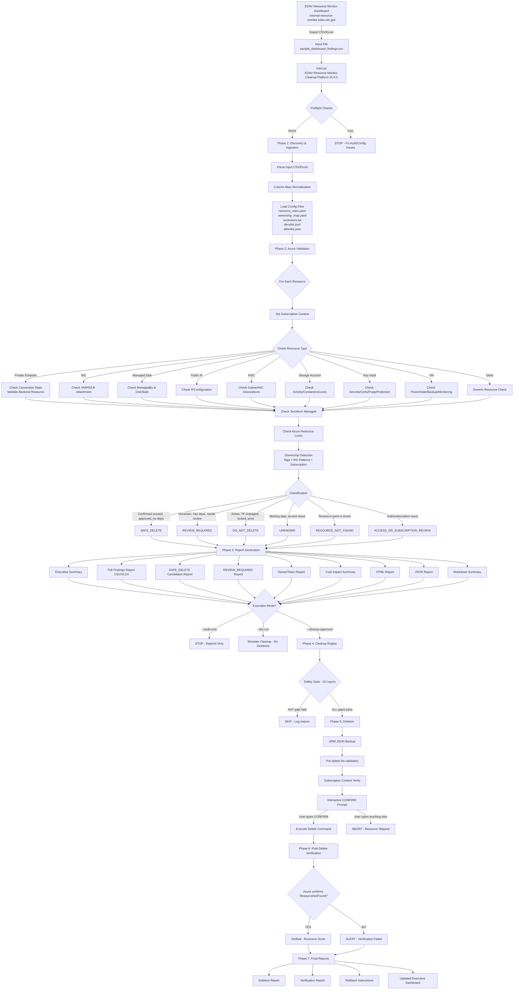
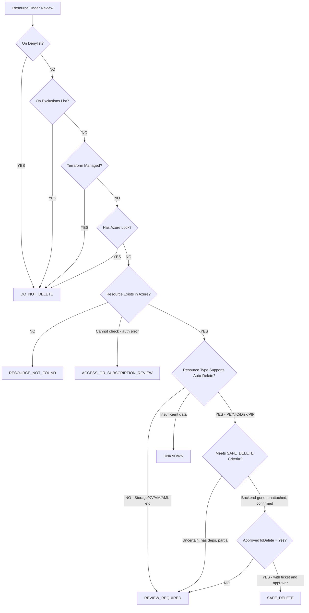
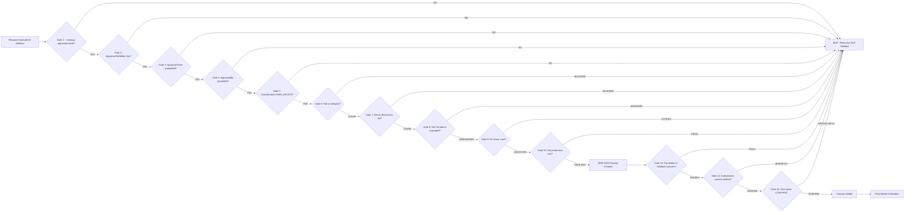
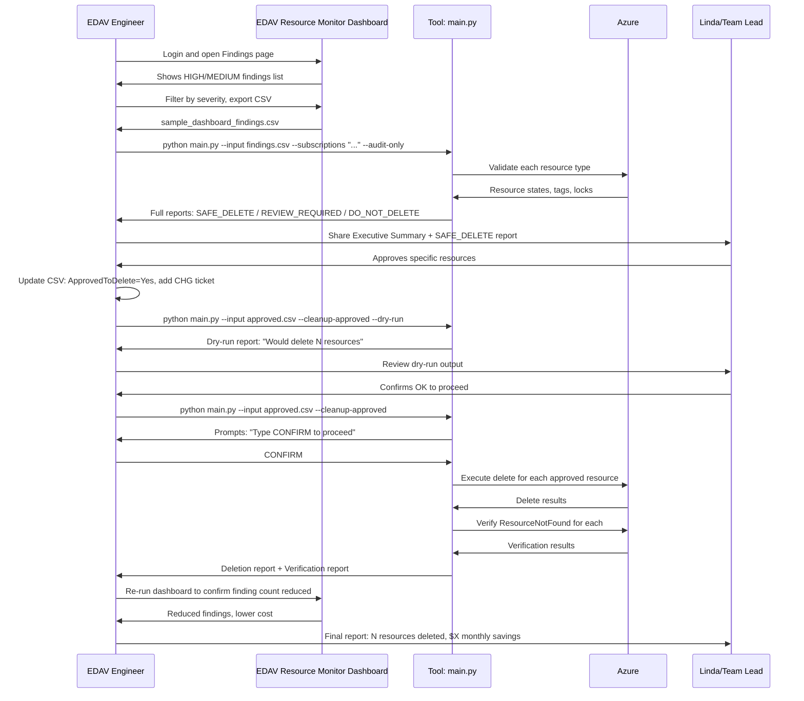

# EDAV Resource Monitor Cleanup Platform - Architecture Diagrams

## Platform Architecture

```mermaid
flowchart TD
    A[EDAV Resource Monitor Dashboard<br/>internal-resource-monitor.edav.cdc.gov] -->|Export CSV/Excel| B[Input File<br/>sample_dashboard_findings.csv]
    B --> C[main.py<br/>EDAV Resource Monitor Cleanup Platform v5.0.0]

    C --> D{Preflight Checks}
    D -->|PASS| E[Phase 1: Discovery & Ingestion]
    D -->|FAIL| Z1[STOP - Fix Auth/Config Issues]

    E --> F[Parse Input CSV/Excel]
    F --> G[Column Alias Normalization]
    G --> H[Load Config Files<br/>resource_rules.yaml<br/>ownership_map.yaml<br/>exclusions.txt<br/>denylist.json<br/>allowlist.json]

    H --> I[Phase 2: Azure Validation]
    I --> J{For Each Resource}

    J --> K[Set Subscription Context]
    K --> L{Check Resource Type}

    L -->|Private Endpoint| M1[Check Connection State<br/>Validate Backend Resource]
    L -->|NIC| M2[Check VM/PE/LB Attachment]
    L -->|Managed Disk| M3[Check ManagedBy & DiskState]
    L -->|Public IP| M4[Check IPConfiguration]
    L -->|NSG| M5[Check Subnet/NIC Associations]
    L -->|Storage Account| M6[Check Activity/Containers/Locks]
    L -->|Key Vault| M7[Check Secrets/Certs/PurgeProtection]
    L -->|VM| M8[Check PowerState/Backup/Monitoring]
    L -->|Other| M9[Generic Resource Check]

    M1 & M2 & M3 & M4 & M5 & M6 & M7 & M8 & M9 --> N[Check Terraform Managed]
    N --> O[Check Azure Resource Locks]
    O --> P[Ownership Detection<br/>Tags + RG Patterns + Subscription]

    P --> Q{Classification}
    Q -->|Confirmed unused, approved, no deps| R1[SAFE_DELETE]
    Q -->|Uncertain, has deps, needs review| R2[REVIEW_REQUIRED]
    Q -->|Active, TF-managed, locked, prod| R3[DO_NOT_DELETE]
    Q -->|Missing data, access issue| R4[UNKNOWN]
    Q -->|Resource gone in Azure| R5[RESOURCE_NOT_FOUND]
    Q -->|Auth/subscription issue| R6[ACCESS_OR_SUBSCRIPTION_REVIEW]

    R1 & R2 & R3 & R4 & R5 & R6 --> S[Phase 3: Report Generation]

    S --> T1[Executive Summary]
    S --> T2[Full Findings Report CSV/XLSX]
    S --> T3[SAFE_DELETE Candidates Report]
    S --> T4[REVIEW_REQUIRED Report]
    S --> T5[Owner/Team Report]
    S --> T6[Cost Impact Summary]
    S --> T7[HTML Report]
    S --> T8[JSON Report]
    S --> T9[Markdown Summary]

    T1 & T2 & T3 & T4 & T5 & T6 & T7 & T8 & T9 --> U{Execution Mode?}

    U -->|--audit-only| V1[STOP - Reports Only]
    U -->|--dry-run| V2[Simulate Cleanup - No Deletions]
    U -->|--cleanup-approved| V3[Phase 4: Cleanup Engine]

    V3 --> W{Safety Gate - 15 Layers}
    W -->|ANY gate fails| X[SKIP - Log reason]
    W -->|ALL gates pass| Y[Phase 5: Deletion]

    Y --> AA[ARM JSON Backup]
    AA --> BB[Pre-delete Re-validation]
    BB --> CC[Subscription Context Verify]
    CC --> DD[Interactive CONFIRM Prompt]
    DD -->|User types CONFIRM| EE[Execute Delete Command]
    DD -->|User types anything else| FF[ABORT - Resource Skipped]

    EE --> GG[Phase 6: Post-Delete Verification]
    GG --> HH{Azure confirms ResourceNotFound?}
    HH -->|YES| II[Verified - Resource Gone]
    HH -->|NO| JJ[ALERT - Verification Failed]

    II & JJ --> KK[Phase 7: Final Reports]
    KK --> LL[Deletion Report]
    KK --> MM[Verification Report]
    KK --> NN[Rollback Instructions]
    KK --> OO[Updated Executive Dashboard]
```

## Classification Decision Tree

```mermaid
flowchart TD
    A[Resource Under Review] --> B{On Denylist?}
    B -->|YES| Z[DO_NOT_DELETE]
    B -->|NO| C{On Exclusions List?}
    C -->|YES| Z
    C -->|NO| D{Terraform Managed?}
    D -->|YES| Z
    D -->|NO| E{Has Azure Lock?}
    E -->|YES| Z
    E -->|NO| F{Resource Exists in Azure?}
    F -->|NO| G[RESOURCE_NOT_FOUND]
    F -->|Cannot check - auth error| H[ACCESS_OR_SUBSCRIPTION_REVIEW]
    F -->|YES| I{Resource Type Supports Auto-Delete?}
    I -->|NO - Storage/KV/VM/AML etc| J[REVIEW_REQUIRED]
    I -->|YES - PE/NIC/Disk/PIP| K{Meets SAFE_DELETE Criteria?}
    K -->|Backend gone, unattached, confirmed| L{ApprovedToDelete = Yes?}
    K -->|Uncertain, has deps, partial| J
    L -->|NO| J
    L -->|YES - with ticket and approver| M[SAFE_DELETE]
    I -->|Insufficient data| N[UNKNOWN]
```

## Safety Gate Model

```mermaid
flowchart LR
    A[Resource Queued for Deletion] --> G1
    G1{Gate 1: --cleanup-approved mode?} -->|NO| STOP
    G1 -->|YES| G2
    G2{Gate 2: ApprovedToDelete=Yes?} -->|NO| STOP
    G2 -->|YES| G3
    G3{Gate 3: ApprovalTicket populated?} -->|NO| STOP
    G3 -->|YES| G4
    G4{Gate 4: ApprovedBy populated?} -->|NO| STOP
    G4 -->|YES| G5
    G5{Gate 5: Classification=SAFE_DELETE?} -->|NO| STOP
    G5 -->|YES| G6
    G6{Gate 6: Not on Denylist?} -->|BLOCKED| STOP
    G6 -->|CLEAR| G7
    G7{Gate 7: Not on Exclusions list?} -->|BLOCKED| STOP
    G7 -->|CLEAR| G8
    G8{Gate 8: Not Terraform-managed?} -->|MANAGED| STOP
    G8 -->|UNMANAGED| G9
    G9{Gate 9: No Azure Lock?} -->|LOCKED| STOP
    G9 -->|UNLOCKED| G10
    G10{Gate 10: Not production env?} -->|PROD| STOP
    G10 -->|SAFE ENV| G11
    G11[ARM JSON Backup Created] --> G12
    G12{Gate 12: Pre-delete re-validation passes?} -->|FAILS| STOP
    G12 -->|PASSES| G13
    G13{Gate 13: Subscription context verified?} -->|MISMATCH| STOP
    G13 -->|VERIFIED| G14
    G14{Gate 14: User types CONFIRM?} -->|WRONG INPUT| STOP
    G14 -->|CONFIRM| DELETE[Execute Delete]
    DELETE --> VERIFY[Post-Delete Verification]
    STOP[SKIP - Resource NOT Deleted]
```

## Monthly Workflow

```mermaid
sequenceDiagram
    participant DA as EDAV Engineer
    participant DB as EDAV Resource Monitor Dashboard
    participant TL as Tool: main.py
    participant AZ as Azure
    participant LJ as Linda/Team Lead

    DA->>DB: Login and open Findings page
    DB->>DA: Shows HIGH/MEDIUM findings list
    DA->>DB: Filter by severity, export CSV
    DB->>DA: sample_dashboard_findings.csv

    DA->>TL: python main.py --input findings.csv --subscriptions "..." --audit-only
    TL->>AZ: Validate each resource type
    AZ->>TL: Resource states, tags, locks
    TL->>DA: Full reports: SAFE_DELETE / REVIEW_REQUIRED / DO_NOT_DELETE

    DA->>LJ: Share Executive Summary + SAFE_DELETE report
    LJ->>DA: Approves specific resources
    DA->>DA: Update CSV: ApprovedToDelete=Yes, add CHG ticket

    DA->>TL: python main.py --input approved.csv --cleanup-approved --dry-run
    TL->>DA: Dry-run report: "Would delete N resources"

    DA->>LJ: Review dry-run output
    LJ->>DA: Confirms OK to proceed

    DA->>TL: python main.py --input approved.csv --cleanup-approved
    TL->>DA: Prompts: "Type CONFIRM to proceed"
    DA->>TL: CONFIRM
    TL->>AZ: Execute delete for each approved resource
    AZ->>TL: Delete results
    TL->>AZ: Verify ResourceNotFound for each
    AZ->>TL: Verification results
    TL->>DA: Deletion report + Verification report

    DA->>DB: Re-run dashboard to confirm finding count reduced
    DB->>DA: Reduced findings, lower cost
    DA->>LJ: Final report: N resources deleted, $X monthly savings
```
